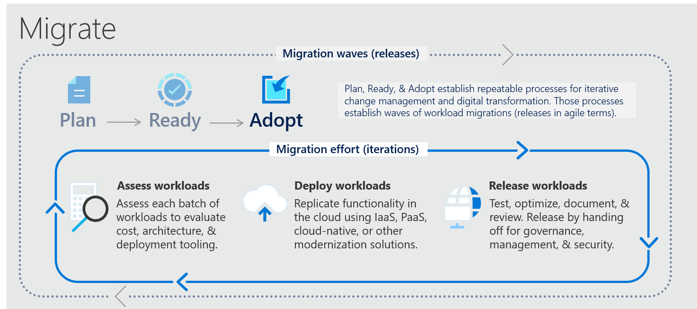

# Microsoft Cloud Adoption Framework (CAF) Adopt

Das Modul Adopt ist das Modul, wo die ersten Workloads in die Cloud kommen. Das Modul Adopt kann zwei grundsätzliche Ausprägungen haben.

- Adopt - Migrate
- Adopt - Innovate

**Adopt-Migrate** hat den Fokus einen bestehenden Workload möglichst einfach in die Cloud zu haben. Oft wird hier der Bergiff Lift-and-Shift benutzt. Also Virtuelle Maschinen mit wenig Veränderungen direkt in die Cloud zu bringen.

**Adopt-Innovate** hingegen deckt den kompletten Bereich des Neuerstellen von Workloads in der Cloud ab. Ziel ist bei Adopt-Innovate den Workload einer Innovation zu unterziehen und die Mehrwerte von Cloud und cloud-native Pattern anzuwenden.

Eine gute Parallele ist die Idee der Anwendung einer der Rs aus den 5Rs für einen Workload auf dem Weg in die Cloud (vgl. [Cloudrationalisierung](https://docs.microsoft.com/azure/cloud-adoption-framework/digital-estate/5-rs-of-rationalization))

Wobei *Rehosten* dem Azure-Migrate entspricht und die weiteren Rs Refactoring, Rearchitect, Rebuild und Replace sich bei Adopt-Innovate wiederfinden.

## CAF - Adopt

<iframe width="560" height="315" src="https://www.youtube-nocookie.com/embed/ZNBSER5QWdY" title="CAF Einführung - Adopt" frameborder="0" allow="accelerometer; autoplay; clipboard-write; encrypted-media; gyroscope; picture-in-picture" allowfullscreen></iframe>

[Folien aus dem Video](https://raw.githubusercontent.com/caf-expert/caf-intro/main/slides/CAF%20Intro%20-%20Adopt.pptx)

### Adopt - Migrate

Der Cloudeinführungsplan jedes Unternehmens beinhaltet Workloads, die keine umfangreichen Investitionen in die Erstellung neuer Geschäftslogik erfordern. Diese Workloads können mithilfe verschiedener Methoden in die Cloud migriert werden: per Lift & Shift, per Lift & Optimize oder mittels Modernisierung. Jede der Methoden wird als Migration betrachtet.

Zur Vorbereitung auf diese Phase des Cloudeinführungszyklus werden die folgenden Schritte empfohlen:

- **Migrieren Ihrer ersten Worklaods:** Machen Sie sich mithilfe des Leitfadens zur Azure-Migration mit den nativen Azure-Tools und dem Ansatz für die Migration vertraut.
- **Migrationsszenarien:** Nutzen Sie zusätzliche Migrationstools und -ansätze für weitere Migrationsszenarien.
- **Bewährte Methoden:** Gehen Sie allgemeine Migrationsanforderungen durch die Anwendung einheitlicher Best Practices an.
- **Prozessverbesserung:** Die Migration ist stark prozessorientiert. Nutzen Sie diese Prozessverbesserungen, um verschiedene Aspekte Ihrer Migration zu bewerten und weiterzuentwickeln und auf Veränderungen bei den Migrationsaufgaben zu reagieren.

Folgendes Schaubild zeigt das grundsätzliche Migrationsvorgehen:

### Adopt - Innovate

Alle IT-Portfolios enthalten einige Workloads und Ideen, die die Position eines Unternehmens im Markt deutlich verbessern könnten. Die meisten Bemühungen zur Cloud-Einführung konzentrieren sich auf die Migration und Modernisierung vorhandener Workloads. Cloud-Innovationen können jedoch den größten geschäftlichen Nutzen bieten. Innovationen im Zusammenhang mit der Cloud-Einführung können neue technische Fähigkeiten und erweiterte Geschäftsmöglichkeiten freisetzen.

In der Innovate-Methodik des Cloud Adoption Framework konzentrieren wir uns darauf, die Kundenbedürfnisse zu verstehen und schnell Innovationen zu entwickeln, die die Art und Weise beeinflussen, wie Ihre Kunden mit Ihren Produkten interagieren. Wir werden auch einen Ansatz veranschaulichen, um den Wert eines Minimum Viable Product (MVP) zu liefern.

Folgendes Schaubild zeigt eine Zusammenfassung zum Thema Innovation im Cloud Adoption Framework:

[CAF Innovate](/media/innovate-methodology.png)

## Modul Adopt - Weitere Quellen

[Get started: Accelerate migration](https://docs.microsoft.com/azure/cloud-adoption-framework/get-started/migrate)
[Dokumentation zu Azure Migrate](https://docs.microsoft.com/azure/migrate/)
[Azure Migration Guide](https://docs.microsoft.com/azure/cloud-adoption-framework/migrate/azure-migration-guide/)

[Microsoft Dokumentation - Adopt Innovate](https://docs.microsoft.com/azure/cloud-adoption-framework/innovate/)
[Azure Innovation Guide](https://docs.microsoft.com/azure/cloud-adoption-framework/innovate/innovation-guide/)

## Liefergegenstände im Modul Adopt

### Modul Adopt - Primäre Liefergegenstände

#### Migrate

- Aufbau einer Migrationsfabrik für die vorhanden Workloads und kontinuierliche Migration von Applikation in Wellen (Power of 10)
- Kontinuierliche Inbetriebnahme von migrierten Workloads in der Cloud

#### Innovate

- Business Value Konsensus Workshop
- Etablierte Feedbackschleifen für Kunden (intern/extern)
- MVP für erste gewünschte Lösung
- Zukünftige iterative Planung für MVP und weitere Entwicklungsschritte 

### Modul Adopt - Ergänzende Liefergegenstände

#### Migrate

- Managed Service Angebote für Workloads in der Cloud als Substitut für bestehende Workloads

#### Innovate

- Innovationsansatz spezifisch für digitale Innovationen, die zu skalierbaren Ergebnisse führen (vgl.[D.E.E.I.P](https://docs.microsoft.com/azure/cloud-adoption-framework/innovate/considerations/invention))
- Langfristige Zusammenarbeit, um Wissensaufbau und –transfer sicher zu stellen

## Tools für das Modul Adopt

[Microsoft Dokumentation - Adopt Migrate](https://docs.microsoft.com/azure/cloud-adoption-framework/migrate/)
[Microsoft Well Architected Assessment](https://docs.microsoft.com/assessments/?mode=pre-assessment&id=azure-architecture-review)